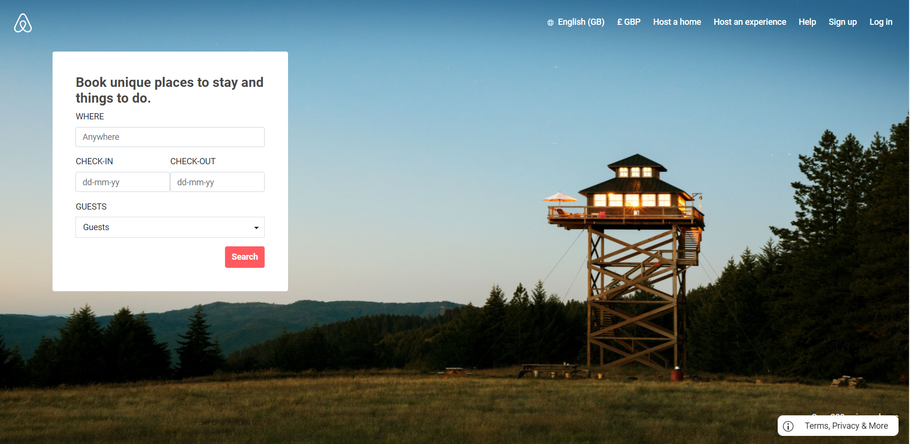
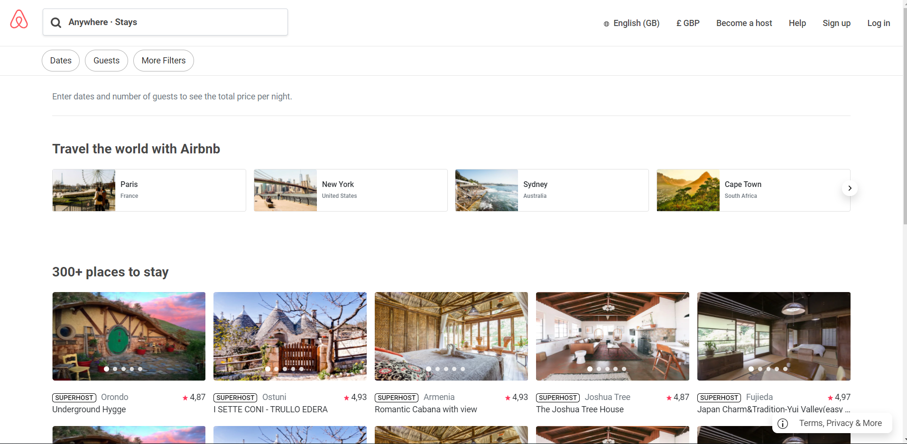
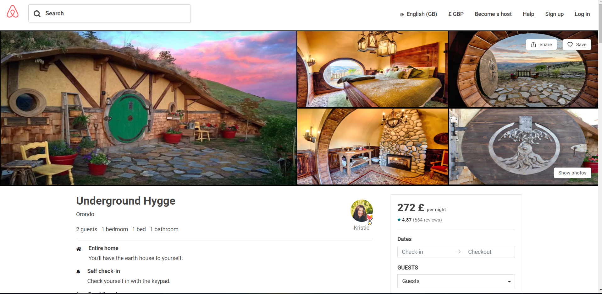

# Airbnb-Clone

This repository is a copy of some pages (fully responsive) of Airbnb web page.

I used Webpack, SCSS, Bootstrap, JQuery.

To run, consecutively:

<code>npm i</code>

<code>npm run build</code>

<code>npm start</code>

Screenshots:

Home:

Homes:

Rooms:

Here are the links to actual pages:

index: https://www.airbnb.co.uk/

homes: https://www.airbnb.co.uk/s/homes

rooms: https://www.airbnb.co.uk/rooms/8794484?source_impression_id=p3_1573732036_b7SBeKS8ire8yuN8

Notes:

- Airbnb made changes since I started to implement the project, there might be some differences.
